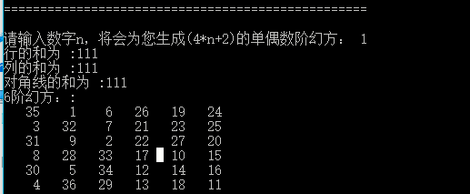
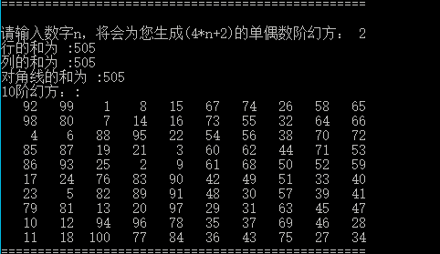
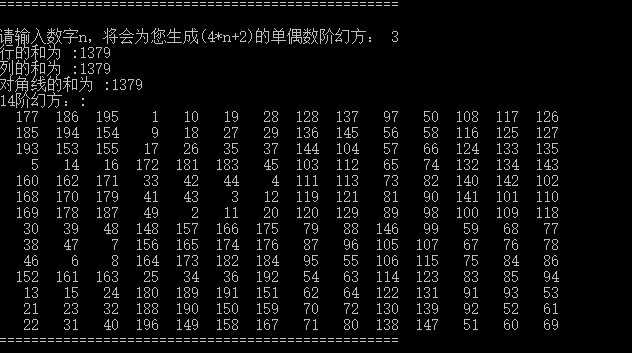
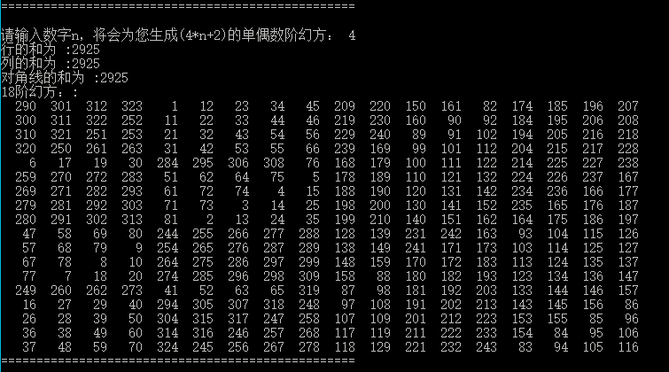
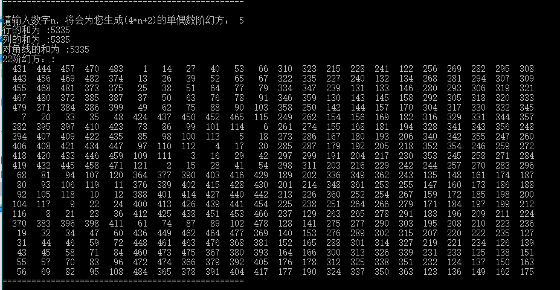

# **单偶数阶幻方生成器作业完成报告**

> 学号：`1651162`
>
> 姓名：`施程航`
>
> 语言：`c++`
>
> 开发环境：windows visual studio

- 需求分析

    输入1-4中的某个数字x，输出显示4x+2阶的幻方结果。(即**所有20以内奇数阶的幻方**)

- 解题思路

    单偶阶幻方是属于较复杂的一种幻方，本项目采用**斯特雷奇(Ralph Strachey)单偶阶幻方构造法**。单偶阶指的是所求幻方阶数`n`为偶数，且不能被4整除(n = 6,10,14,18)。取`n=m*4+2` `h=n/2(h=2*m+1)`，该构造方法如下：
    1.把方阵分为`A`,`B`,`C`,`D`四个部分，每个方阵的行和列的大小均为`h`，即各个方阵均为一个奇数阶方阵，记左上、右上、左下、右下四个方阵为A B C D。在A方阵中把`1 -- h*h`按照奇数阶幻方的方法填入，B C D方阵则将A方阵上对应的位置上的数再分别加上`2*h*h`、`h*h`、`3*h*h`。以`n=10`为例，执行完此步骤后得到方阵如下：
    ```c++
    17   24    1    8   15   67   74   51   58   65
   23    5    7   14   16   73   55   57   64   66
    4    6   13   20   22   54   56   63   70   72
   10   12   19   21    3   60   62   69   71   53
   11   18   25    2    9   61   68   75   52   59
   92   99   76   83   90   42   49   26   33   40
   98   80   82   89   91   48   30   32   39   41
   79   81   88   95   97   29   31   38   45   47
   85   87   94   96   78   35   37   44   46   28
   86   93  100   77   84   36   43   50   27   34
    ```
    2.A象限的中间行、中间格(也即在大方阵的`m`行`m`列)，按从左到右的方向选出`m`格。A象限的其他行则标出最左边的`m`格，所有标记出来的数和C象限对应位置上的数交换位置。以`n=10`为例，执行完此步骤后得到方阵如下：
    ```c++
    92   99    1    8   15   67   74   51   58   65
   98   80    7   14   16   73   55   57   64   66
    4    6   88   95   22   54   56   63   70   72
   85   87   19   21    3   60   62   69   71   53
   86   93   25    2    9   61   68   75   52   59
   17   24   76   83   90   42   49   26   33   40
   23    5   82   89   91   48   30   32   39   41
   79   81   13   20   97   29   31   38   45   47
   10   12   94   96   78   35   37   44   46   28
   11   18  100   77   84   36   43   50   27   34
    ```
    3.在B象限的所有行的中间格子，从左到右，标出`m-1`(比如10阶方阵则是一格)个格子，所有标出的格子和D象限相应位置上的数进行交换，幻方形成，以`n=10`为例，执行完此步骤后得到方阵如下：
    ```c++
    92   99    1    8   15   67   74   26   58   65
   98   80    7   14   16   73   55   32   64   66
    4    6   88   95   22   54   56   38   70   72
   85   87   19   21    3   60   62   44   71   53
   86   93   25    2    9   61   68   50   52   59
   17   24   76   83   90   42   49   51   33   40
   23    5   82   89   91   48   30   57   39   41
   79   81   13   20   97   29   31   63   45   47
   10   12   94   96   78   35   37   69   46   28
   11   18  100   77   84   36   43   75   27   34
    ```

- 算法设计
  - **生成单阶幻方**

    单阶幻方是斯特雷奇构造法中构造偶数阶幻方的基础，单阶幻方的构造方法较为简单：

    - 1.将1放在第一行中间的格子上
    - 2.从`2 -- n*n`为止，按45°方向比如向右上行走(也即每一个数存放的行比签一个属的行数减一，列数加一)
    - 3.如果行数或列数超出方阵范围，则回绕(也即-1变为n-1或者n变为0，默认下表从0开始)
    - 4.如果按2、3规则找到的位置上已经有数，则把当前的数放在该位置的下面
    ```c++
    void process_odd(int n, std::vector<std::vector<int > > &container)
    {
        assert(n % 2 == 1);
        //std::vector<std::vector<int> > container(n, std::vector<int>(n, 0));

        int row = 0, col = n / 2;
        for (int num = 1;num <= n * n;++num) {
            container[row][col] = num;
            if (container[(row + n - 1) % n][(col + 1) % n] == 0) {
                row = (row + n - 1) % n;
                col = (col + 1) % n;
            }
            else
                row = (row + 1) % n;
        }

        //display(container);
    }
    ```
  - **运行算法**
    按照斯特雷奇法的步骤进行填数和换数
    ```c++
    std::vector<std::vector<int> > process_single_even(int n)
    {
        assert(n % 4 == 2 && n != 2);

        std::vector<std::vector<int> > container(n, std::vector<int>(n, 0));

        int half_n = n / 2;
        //step1
        process_odd(half_n, container);
        for (int row = 0;row < half_n;++row)
            for (int col = 0;col < half_n;++col) {
                int cur = container[row][col];
                container[row][col + half_n] = cur + 2 * half_n*half_n;
                container[row + half_n][col] = cur + 3 * half_n*half_n;
                container[row + half_n][col + half_n] = cur + half_n * half_n;
            }
        //display(container);
        //5 2
        using std::swap;
        int quarter = (n - 2) / 4;
        //step2
        for (int row = 0;row < half_n;++row)
            for (int col = 0;col < quarter;++col) {
                if (row != quarter)
                    swap(container[row][col], container[row + half_n][col]);
                else
                    swap(container[row][col + quarter],
                        container[row + half_n][col + quarter]);
        }
        //display(container);
        //step3
        for (int row = 0;row < half_n;++row) {
            for (int col = n - quarter - 1;col > half_n + 1;--col)
                swap(container[row][col], container[row + half_n][col]);
        }

        check(container);

        std::cout << "\n"<< n <<"阶幻方：:\n";
        display(container);
        std::cout << std::string(50, '=') << "\n\n";

        return container;
    }
    ```
  - **检查幻方是否正确生成**
    检查分为四个步骤进行：

    - 1.检查方阵各行的和是否相等

    - 2.检查方阵各列的和是否相等

    - 3.检查方阵的两条对角阵的和是否相等

    - 4.检查列的和、行的和以及对角线的和是否均相等

    若条件1 2 3 4均满足那么生成的方阵是正确的
    ```c++
    bool check(std::vector<std::vector<int> >& container)
    {
        int row_size = container.size();
        int col_size = container[0].size();//actually, the row_size and col_size should be equal
        //
        int row_sum = 0,
        col_sum = 0,
        diagonal_sum_1 = 0, diagonal_sum_2 = 0;

        //calculate row_sum
        for (int row = 0;row < row_size;++row) {
            int temp_sum = 0;
            for (int col = 0;col < col_size;++col)
                temp_sum += container[row][col];
            if (row_sum != 0 && row_sum != temp_sum) {
                std::cout << "各行的和不相等\n";
                return false;
            }
            //update row_sum
            row_sum = temp_sum;
        }
        //calculate col_sum
        for (int col = 0;col < col_size;++col) {
            int temp_sum = 0;
            for (int row = 0;row < row_size;++row)
                temp_sum += container[row][col];
            if (row_sum != 0 && row_sum != temp_sum) {
                std::cout << "各列的和不相等\n";
                return false;
            }
            //update
            col_sum = temp_sum;
        }
        //diagonal_sum
        for (int step = 0;step < row_size;++step) {
            diagonal_sum_1 += container[step][step];
            diagonal_sum_2 += container[step][col_size - step - 1];
        }
        if (diagonal_sum_1 != diagonal_sum_2) {
            std::cout << "两对角线的和不相等!\n";
            return false;
        }
        if (row_sum != col_sum || row_sum != diagonal_sum_1) {
            std::cout << "行、列、对角线的值不全相等!\n";
            return false;
        }
        std::cout << "行的和为 :" << row_sum;
        std::cout << "\n列的和为 :" << col_sum;
        std::cout << "\n对角线的和为 :" << diagonal_sum_1;

        return true;
    }
    ```

- 结果分析
  - 用程序接受所要求的范围内输出均正确

    1.`n=1`，生成6阶方阵
    

    2.`n=2`，生成10阶方阵
    

    3.`n=3`，生成14阶方阵
    

    4.`n=4`，生成18阶方阵
    

  - 对于`n=5`程序也能很好工作

    5.`n=5`，生成22阶方阵
    
  - 理论上程序能生成任意阶奇偶阶方阵
- 结论
  - 通过斯特雷奇法可以正确生成奇偶阶幻方
  - 在该构造法中，奇偶阶幻方的工作正确性基于奇数阶幻方的正确性，说明不同类型的幻方之间存在着一定的联系
  - 生成幻方后需要对幻方进行正确性的检查，以保证算法没有错误

- 参考

  [奇数阶、偶数阶幻方制作方法](https://wenku.baidu.com/view/8e8bdbf3f61fb7360b4c6557.html)