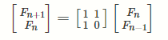
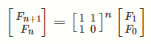
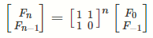
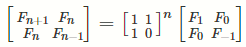
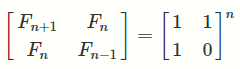
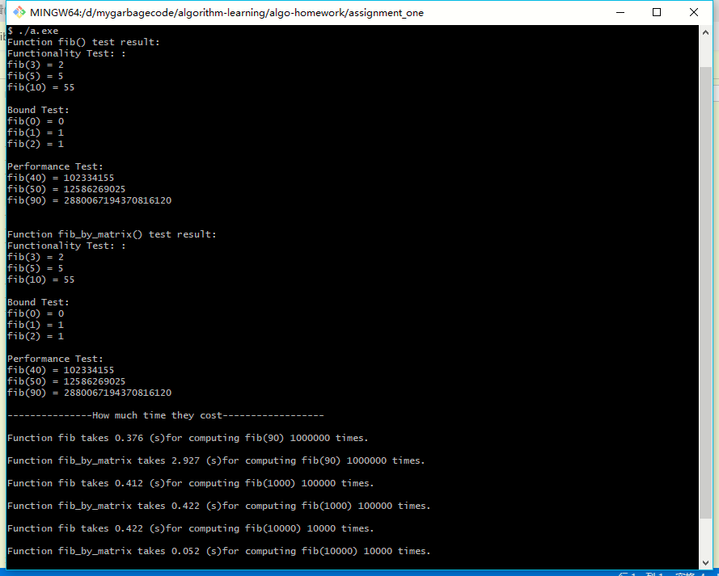

# 算法与设计分析 Assiment one

> 施程航 1651162

## 文件备注

1. fib.cpp: 算法功能代码
2. test.cpp, test.h: 算法测试代码
3. 运行结果截图：存放运行结果的截图
4. a.exe: 可执行文件
5. readme.pdf/readme.md: 对应格式的readme
6. img: readme的插图

本人在windows10采用g++ 6.3.0测试正常。可用以下命令编译并运行：

```shell
g++ -static fib.cpp test.cpp && ./a.exe
```

## 需求分析

一只青蛙一次可以跳上 1 级台阶，也可以跳上 2 级台阶。求该青蛙跳上 1 个 n级的台阶总共有多少种跳法。

记f(n)为该青蛙跳上n级的台阶跳法种数，因为青蛙一次只能跳一个或者两个台阶，故而f(n)取决于f(n-1)和f(n-2)。其实就是斐波那契数列(Fibonacci sequence)

注意到测试用例中需要计算f(90)，其值据估计在`c++` `long long int` 的表示范围，故数据类型采用`long long int`

## 算法实现与效率分析

这里我们实现了两种求解fibnacci数列的方法：

1. 迭代计算
2. 矩阵运算

下面给出主要代码和分析过程

### **迭代计算Fibnacci**

这种方法逻辑上比较之简单，就是在循环内迭代f(n)和f(n-1)，迭代n次可得到最终结果

```c++
/*
* 函数名：fib
* 功能描述：求出第n(n作为函数参数由用户给出)个Fibnacci数
* 输入：所求Fibnacci数的序号
* 输出/返回值：第n个Fibnacci数
*/
inline long long int fib(int n)
{
    assert(n >= 0);
    long long int ans = 0, next = 1;
    //容易看出，第一次进入循环时，ans=fib(0) next=fib(1)
    for (int i = 0;i<n;++i) {
        //计算fib(i+1),fib(i+2)的值，分别存入ans、next中
        long long int temp = ans + next;
        ans = next;
        next = temp;
    }
    //当循环结束时，ans存的值为fib(n)，即为所求结果
    return ans;
}
```

**迭代计算时间复杂度分析**：  
函数fib的基本操作(basic operation)为for循环中的一次加法和两次赋值，时间复杂度为O(1)。循环执行次数为n次，故时间复杂度为O(n)。

### **矩阵乘法计算Fibnacci**

**算法思想**：  

对于Fibnacci数列，其递推公式为`f(n) = f(n-1) + f(n-2)`。于是我们可以做下变形，结合矩阵可以得到以下计算公式：  



更进一步，我们可以推导得到(1)：  



如果我们定义`f(-1) = 1`，我们可以得到这样一个公式(2)：  



根据公式(1)和(2)，我们可以得到：  



注意到等式最右边的矩阵是一个单位矩阵，于是我们可以得到下面的最终推导公式：  



来到这一步，我们就可以通过矩阵乘法的可结合性对算法进行优化。

---
根据推导出的公式，C++实现代码如下：  

```c++
/*
* 函数名: fib_by_matrix
* 功能描述: 求出第n（n作为函数参数由用户给出）个Fibnacci数
* 输入: 所求Fibnacci数的序号
* 输出/返回值: 第n个Fibnacci数
*/
inline long long int fib_by_matrix(int n)
{
    static std::vector<long long> one = {1,1,1,0};
    //利用矩阵乘法的可结合性
    if(n == 0)return 0;
    //取出结果矩阵(2*2)右上角的数值，即为所求fib(n)
    else return (fib_iter(n, one))[1];
}

/*
* 矩阵乘法，计算m1*m2，这里m1和m2都是2*2的二维方阵
* 考虑到性能和方便，这里我们用一个大小为4的一维vector<long long>来表示一个2*2的矩阵
* matrix[i][j]对应vec[2*i+j]
*/
std::vector<long long> mul_matrixs(std::vector<long long>& m1, std::vector<long long>& m2)
{
    //初始化返回矩阵
    std::vector<long long> product(4, 0LL);
    //由于我们这里默认矩阵都是2*2，所以直接把矩阵乘法展开
    product[0] = m1[0]*m2[0]+m1[1]*m2[2];
    product[1] = m1[0]*m2[1]+m1[1]*m2[3];
    product[2] = m1[2]*m2[0]+m1[3]*m2[2];
    product[3] = m1[2]*m2[1]+m1[3]*m2[3];

    return product;
}

/*
* 求mat^n也即mat矩阵的n次方，通过矩阵乘法的可结合性降低时间复杂度
*/
std::vector<long long> fib_iter(int n, std::vector<long long>& mat)
{
    if(n==1)return mat;
    else if(n%2==0){
        //当n为偶数时，先计算结果的平方根然后再做乘法，这是算法复杂度为log(n)的关键
        auto half = fib_iter(n/2, mat);
        return mul_matrixs(half, half);
    }
    else{
        //n为奇数，拆成mat*(mat^(n-1))
        auto part = fib_iter(n-1,mat);
        return mul_matrixs(part, mat);
    }
}
```

以上代码有三个函数，分别是mul_matrix，fib_iter和fib_by_matrix。实现的功能和逻辑在代码注释中已经说明，此处不再赘述。

**算法时间复杂度分析**：  
可以看到，我们是通过矩阵乘法的可结合性来对算法进行优化。理论上计算矩阵的n次方需要log(n)次矩阵乘法，每次矩阵乘法计算量如下：

```c++
product[0] = m1[0]*m2[0]+m1[1]*m2[2];
product[1] = m1[0]*m2[1]+m1[1]*m2[3];
product[2] = m1[2]*m2[0]+m1[3]*m2[2];
product[3] = m1[2]*m2[1]+m1[3]*m2[3];
```

总共是8次乘法，四次加法和四次赋值

## 算法正确性和性能测试

- **算法正确性**

    为了保证算法的正确性，我通过对文档要求的测试数据进行了测试

- **性能测试**

    这个部分我其实主要是想看看两个算法的性能差异，因此我选择了下面几个数据对算法进行测试。这里还要说明的一点是，虽然一些测试数据可能会超出`long long int`能表示的范围，不过我觉得这些数据对算法的性能还是很能说明一些问题的。

    |算法类型|计算fib(90)*100 0000所需时间|计算fib(1000)*10 0000所需时间|计算fib(10000)*10000所需时间|
    |-|-|-|-|
    |迭代计算|0.376s|0.412s|0.422s|
    |矩阵乘法|2.927s|0.422s|0.052s|

测试结果截图如下：  



实现测试功能的代码在`test.cpp`和`test.h`中，由于这部分不涉及算法逻辑，所以在此没有展开，详细的逻辑和功能可以查看对应文件的代码注释。

## 测试结果分析

可以看到，两个算法的功能都正确实现了。另外，从测试结果中我们可以得出一个结论，迭代计算计算小规模的fib(n)要比矩阵乘法快了不少。差不多到了fib(1000)，两个算法的性能差距不是很大，到了fib(10000)基本上矩阵乘法运算的性能显著超过了迭代计算。这也符合我们前面时间复杂度分析的预期。

对于小规模输入时，矩阵乘法计算fib(n)比迭代计算慢的原因，我个人觉得有以下几点需要关注：

- 迭代的基本运算只有加法，而矩阵乘法用了多次乘法和加法
- 我们也可以看到，对于矩阵乘法的实现，我们采用递归，这部分估计也会是一个性能损耗点
- 我们采用std::vector &lt;long long&gt;来表示矩阵，在计算的过程中会涉及到vector的构造与析构

综上，为了实现一个性能还过得去的fibnacci函数，我们可以结合两种算法，当数据规模较小时，采用迭代，数据规模大时采用矩阵乘法运算。