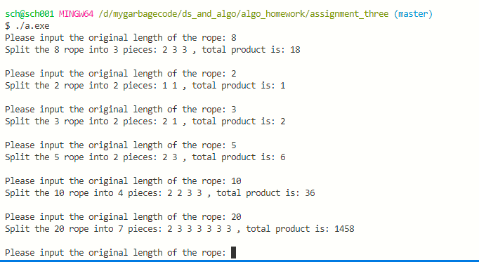

# 算法设计与分析 Assignment 3

> 施程航 1651162

## 需求

给出一根长度为n(n>1)的绳子，把绳子切割成若干段，且分割的段数**大于1**。切割后得到多段绳子，求使得**切割完所有绳子长度乘积最大化的切割方法**。

## 思路

注意到分割的段数大于1，也就是对于一根长度为n的绳子，必须**至少分割一次**。

---

### 放松条件

让我们先考虑这样的一种情况，把限制条件进行一点放松，**绳子可以分割成一段或者多段**。在这种情况下，记`f(n)`表示：长度为n的绳子，进行若干次（包括0次）切割后，**所有段的长度的乘积**。我们可以很容易地想到用动态规划来解决这个问题：

1. 先把绳子切割为两段长为x，y的绳子

2. 再继续切割x和y，获得他们分别的最大乘积

在第一步中，我们有⌊n/2⌋+1种切割方法，分别是{0, n},{1, n-1},...{⌊n/2⌋, n-⌊n/2⌋}。容易看出，我们可以从这⌊n/2⌋+1中方法中选出最优的，对于最优选择{x', y'}，f(n) = f(x')*f(y')。

### 为什么要放松条件

对条件进行放松的原因是为了**避免一些不必要的分割**，因为在切割的过程中事实上有些绳子的段继续切割反而会减小乘积，比如n=3，继续切割均会使得绳子乘积变小{1,1,1}或{1,2}。这时候有两种情况：

- 分割从3开始（即绳子的原始长度是3），必须执行**至少一次分割**

- 然而比如我们的分割是从n=6开始的，那么到绳子长度变为3时就可以不分割了，放松条件正是为了处理这类情况。

### 把限制“加”回去

这样的话会出现一些情况，放松条件后对于n=3我们会得到错误的答案，{3}，事实上应该是{1,2}，那么下一步我们应该思考如何把限制加回去。我们记`f'(n)`为：进行若干次（**至少一次**）切割后，**所有段的长度的乘积**。考虑对于长度n>2的绳子，如果在位置2进行切割，那么我们第一次切割后可以得到{2, n-2}，到了这一步我们可以继续对子段进行切割或者停止切割。那么我们可以确认，对于n>2的绳子，**我们至少可以取得一个解{2, n-2}**，故f'(n)>=2 * (n-2)。在允许不切割绳子时，f(n)还可以取到n。解2 *(n-2)>=n得n>=4。也就是当n>=4时，我们是否放松条件总是可以**通过放松条件后的算法获得最优解**，因为我们取特殊情况{2,n-2}可以获得比不切割时更大的乘积。这样一来，我们只要把特殊情况n=2或3拎出来讨论即可。容易得到，{1,1}和{1,2}分别是n=2和n=3的最佳切割方案。

## 算法设计

### 代码实现

前面说到，我们的算法基于动态规划。我们需要存储计算过程中的状态

```c++
//代表切剪绳子的一个状态
//ropes代表切割后所有的绳子,以长度表示
//product代表绳子的乘积
struct state{
    vector<int> ropes;
    int product;
};
```

按照上面的算法步骤，我们给出如下代码。使用自上而下的迭代计算，求出对应长度绳子的最佳切割组合。

```c++
void dp_iter(int n, vector<state >& mem)
{
    for(int i=2;i<n+1;i++){
        //从底层选择组合
        int res_product = i;
        int split_pos = 0;//切割点离元代你的距离

        // int limit = i/2;
        for(int j=1;j<=i/2;j++){
            if(mem[j].product*mem[i-j].product>res_product){
                res_product = mem[j].product*mem[i-j].product;
                split_pos = j;
            }
        }

        //写回结果
        mem[i].product = res_product;
        //没有发生切割
        if(split_pos==0){
            mem[i].ropes.push_back(i);
        }else{
            //把切割的两块的所有绳子加入ropes
            for(auto item: mem[split_pos].ropes){
                mem[i].ropes.push_back(item);
            }
            for(auto item: mem[i - split_pos].ropes){
                mem[i].ropes.push_back(item);
            }
        }
    }
}
```

以上(dp_iter函数)是放松条件后的算法，所以我们还要对特殊情况(n=2,3)进行特殊讨论，即在读取绳子长度后，做一个判断，根据n的值分别进行处理。

```
int main()
{
    //存储剪绳子的方案
    vector<state > mem;
    int n; // 绳子的总长度

    static string hint = "Please input the original length of the rope: ";
    cout<< hint;
    while(cin>>n){
        //特殊情况
        if(n==2||n==3){
            mem.push_back(state{{n-1,1},n-1});
        }else{
            //初始化
            mem.assign(n+1, state{{},1});
            mem[1] = {{1},1};
            dp_iter(n, mem);
        }
        
        
        display(n, mem);
        cout<<hint;
    }
}
```


### 算法复杂度

上述算法自下而上计算绳子长度为i(i=2,3,...,n)，内层循环需要计算⌊n/2⌋+1次，每次耗费时间为O(1)，故算法的复杂度为O(n<sup>2</sup>)。

### 测试及运行结果

我们选取了几组数据进行了测试，如下：



| 绳子原始长度 | 分割段数 |   分割结果    | 乘积 |
| :----------: | :------: | :-----------: | :--: |
|      8       |    3     |     2,3,3     |  18  |
|      2       |    2     |      1,1      |  1   |
|      3       |    2     |      2,1      |  2   |
|      5       |    2     |      2,3      |  6   |
|      10      |    4     |    2,2,3,3    |  36  |
|      20      |    7     | 2,3,3,3,3,3,3 | 1458 |

