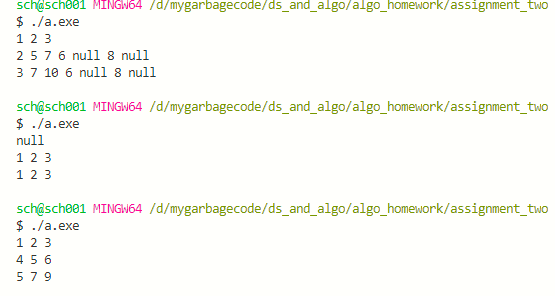

# Assignment 2 合并二叉树

## 问题描述

给出两个二叉树，合并它们并返回合并后的二叉树。合并规则：相同位置的节点值相加。  
如果相同位置都不为 null，则数值相加  
如果相同位置一个树为 null，一个树值为 A，则设置为 A  
如果相同位置都为 null，则设置为 null  

这里我们规定输入的两个数组各占一行，数组内元素用空格分割。

```shell
1 3 2 5 null null
2 1 3 null 4 null 7
```

## 功能实现

由于一个节点可能是数字也可能是null节点，这里我们用`struct node`去表示一个节点。

```c++
struct node{
    node(const string& s){
        if(s[0] == 'n'){
            assert(s=="null");
            isNull = true;
        }else{
            val = stoi(s);
        }
    }
    int val = -1;
    bool isNull = false;
};
```

先通过预处理存储两个输入数组，然后遍历数组，依照题意将相同位置的节点相加，最后输出结果：

```c++
    //让input[0]成为数组中size中较大的那个
    if(inputs[0].size()<inputs[1].size()){
        inputs[0].swap(inputs[1]);
    }
    //依照题意合并数组
    for(int i = 0;i<inputs[1].size();i++){
        if(inputs[1][i].isNull){
            continue;
        }
        //
        if(inputs[0][i].isNull){
            inputs[0][i] = inputs[1][i];
        }else{
            inputs[0][i].val += inputs[1][i].val;
        }
    }

    //输出结果
    for(auto result_node:inputs[0]){
        if(result_node.isNull){
            cout << "null" << ' ';
        }else{
            cout << result_node.val << ' ';
        }
    }
    cout<<'\n';
```

值得一提的是，这里对输入的数组进行预处理时我们用到了`std::stringstream`，主要作用是把所有的“节点”(包括数字节点和空结点)：

```c++
string line;
    //用来存储一行输入也即是一个数组，格式化输入
    istringstream iss;

    for(int i = 0;i<2;i++){
        //获取一行输入
        getline(cin, line);

        iss.clear();//清空缓冲
        iss.str(line);//设置str

        string word;
        //格式化输入
        while(iss>>word){
            // cout<<word<<"\n";
            inputs[i].emplace_back(word);
        }
    }
```

## 时间复杂度

可以看到，合并数组时，我们做了n次循环，其中 n = min(input[0].size(),input[1].size())。每次循环花费O(1)时间，故合并数组部分时间复杂度为O(n)。

对于预处理和输出部分，时间复杂度均为O(n')，其中n' = max(input[0].size(),input[1].size())。综上，程序总时间复杂度为O(n')，n'为两棵待合并的树中节点数较多的节点数量。

## 测试与运行结果

根据给的测试数据：

