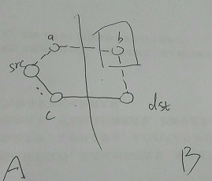

# 算是整理一下自己的思路

如图，把`V`(初始节点集合)分为已被选中的节点(记为`A`)和未被选中的节点(记为`B`)两个集合。`src`为源节点，`dst`为待加入节点，即算法下一步即将加入集合`A`的节点。

下面证明`src`经`c`到达`dst`的路径(记为路径`p1`)是`src -> dst`的最短路径，只需证明两点：

- a. `p1`比其他从`src`出发只经过`A`集合的点到达`dst`的任何路径更短
- b. `p1`比从`src`出发至少经过一个`B`集合的点到达`dst`的任何路径要短

一个结论：

- **dijkstra算法**执行过程中每次进入`A`集合的点均是从`src`出发只经`A`中的点到达`B`的点中路程最短的点`(*)`。这是算法选取点的依据。

论证

- a容易得证
- 假设存在某条路径`p2`，从`src`出发经过至少一个B的点到达`dst`，且满足条件`length(p2) < length(p1)`，记`p2`中位于从`src`出发到达的第一个属于`B`的节点为`b`，比如图中的`src->a->...->b->...->dst`，不失一般性，`...`表示`...`两端的节点之间可能有其他节点。记`p2`的子路径`src->a->b`为`p3`，容易得知`length(p3) < length(p2) < length(p1)`，也即存在`B`中的点`b`使得从`src`出发只经过`A`的节点到达`B`满足`distance(src, b) < distance(src, dst)`，这与结论`(*)`矛盾。故不存在路径`p2`满足从`src`出发经过至少一个`B`的点到达`dst`并且满足`length(p2) < length(p1)`，即`b`得证。

综上，`src`经`c`到达`dst`的路径(记为路径`p1`)是`src -> dst`的最短路径。每次都满足这个结论，那么计算出来的`src`到任意节点的距离均是它们的最短距离。